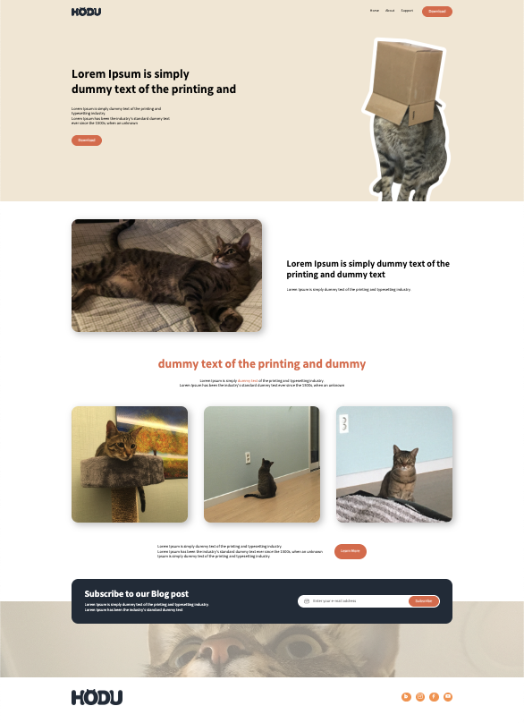
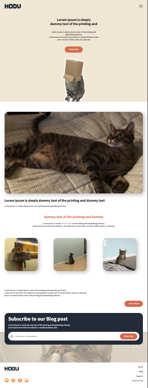

# Hodu를 소개합니다.

## 💻 프로젝트 소개

고양이 'HODU'를 소개하는 페이지 입니다.

## 🚀 바로가기

[Hodu 소개](https://kumgold.github.io/oreumi-hodu/index.html)

## 🛠️ 사용 기술

-   HTML
-   CSS

## 📂 폴더 구조

```
root/
├── css/
│   ├── reset.css
│   └── style.css
├── img/
├── index.html
└── README.md
```

## 👀 목표

-   HTML/CSS 기본 문법에 대한 이해
-   반응형 웹에 대한 이해 (데스크탑, 모바일 버전)
-   프로젝트 개발 경험

## 🏞️ 화면

| 데스크탑                           | 모바일                            |
| ---------------------------------- | --------------------------------- |
|  |  |

## 프로젝트를 진행하면서 느낀점
Z-Index를 활용한 배치가 어려웠다. 사용할 때는 자연스러운 기능이었지만, 직접 구현할 때 특정 화면에서만 보이는 UI를 그리고 배치하는 것도 신선했던 것 같다. 
그리고 영역 잡는게 까다로웠다. 아직 정렬, 배치가 익숙하지 않다고 느꼈다.